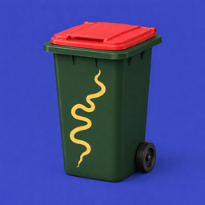

<p align="center">
  
</p>

# Brisbane Bin Day Sensor

This project creates two new Home Assistant binary sensors that provide details of bin collections in the Brisbane City Council area.  One sensor is for the "normal" (or optionally green bin) week while the other is for the recycle (yellow bin) week.  Two sensors are used to enable the creation of alerts in Home Assistant with names specific to the weeks.

If desired, a third optional sensor can be created for the annual kerdside collections which can also be used for alerts.

While most Councils provide details of their waste collection schedules via their Open Data portals there is no consistency or standards in how the data is structured (especially when it comes to the recycle week determination).  Therefore, it is not possible to create a generic sensor but you are welcome to fork this code and cusrtomize it for your particular Council. 

## Installation (HACS) - Recommended
1. Click the button below to open the repository in HACS:

  [](https://my.home-assistant.io/redirect/hacs_repository/?owner=mark1foley&repository=Brisbane-Bin-Day-Sensor&category=integration)

2. Click **Download**.
3. Restart Home Assistant.

## Installation (Manual)
1. Download this repository as a ZIP (green button, top right) and unzip the archive
2. Copy `/custom_components/bne_wc` to your `<config_dir>/custom_components/` directory
   * You will need to create the `custom_components` folder if it does not exist
   * On Hassio the final location will be `/config/custom_components/bne_wc`
   * On Hassbian the final location will be `/home/homeassistant/.homeassistant/custom_components/bne_wc`

## Configuration
1. Click the button below to open the repository in HACS:

  [](https://my.home-assistant.io/redirect/config_flow_start/?domain=bne_wc)

2. Select your *Suburb* then click **Submit**.
3. Select your *Street* then click **Submit**.
4. Select your *House Number*, chose if you would like a Kerbside Collection Sensor, then click **Submit**.
3. Check your *Address* then click **Finish**.

You should then see details of the service created.

To change the service address:

1. Remove the existing service using the *Kebab* (3 Dots) menu
2. Click **Add Service** to add the new address

## Sensor

The integration creates a sensor with the name specified in the configuration with the following attributes.

- **name** (*String*): As specified in the configuration.  The "recycle" week sensor has the suffix " (Recycle)"
- **Property Number** (*Integer*): As specified in the configuration 
- **Alert Hours** (*Integer*): As specified in the configuration 
- **Suburb** (*String*): Name of suburb returned from the Open Data website for the specified property  
- **Street** (*String*): Name of street, road etc returned from the Open Data website for the specified property  
- **House Number** (*String*): Lot/street number returned from the Open Data website for the specified property  
- **Collection Day** (*String*): Collection day name (MONDAY, TUESDAY etc) for the specified property  
- **Collection Zone** (*String*): Collection zone for the specified property.  Used to determine which extra bin to put out for the next collection
- **Next Collection Date** (*DateTime*): Date and time (at 12:00AM) of the next collection day for the specified property 
- **Extra Bin** (*String*): Name of the extra bin to be put out for the next collection (either 'Yellow/Recycle' or 'Green/Garden')
- **Due In** (*Integer*): Number of hours until the 12:00AM on the next collection day for the specified property 
- **Recycle Week**: true/false to indicate if this is the "recycle" week sensor
- **icon** (*String*): As specified in the configuration, or default of mdi:trash-can
- **friendly_name** (*String*): As specified in the configuration

## Kerbside Sensor

If configured, the integration creates a sensor with the name specified in the configuration with the following attributes.

- **name** (*String*): As specified in the configuration.  The "recycle" week sensor has the suffix " (Kerbside)"
- **Next Kerbside Collection Date** (*DateTime*): Date and time (at 12:00AM) of the day kerbside items will actually be collected
- **Next Kerbside On Footpath Date** (*DateTime*): Date and time (at 12:00AM) of the day kerbide items need to be on the footpath ready for collection 
- **Kerbside Due In** (*Integer*): Number of hours until the 12:00AM on the next kerbside collection on footpath day for the specified property 
- **Kerbside Alert Hours** (*Integer*): As specified in the configuration
- **icon** (*String*): As specified in the configuration, or default of mdi:truck
- **friendly_name** (*String*): As specified in the configuration

The state of the sensor will be set to 'off' unless the 'Kerbside Due In' attribute is less than or equal to the 'Kerbside Alert Hours' when it will be set to 'on'.  The state will return to 'off' when the 'Kerbside Due In' attribute reaches 0.  Note that 'Kerbside Due In' is calculated relative to the 'Next Kerbside On Footpath Date' and not the 'Next Kerbside Collection Date'.

## Alerts

Home assistant alerts that use notifications can be setup to monitor the state of the sensors.  Here are some examples.

```yaml
  take_the_bin_out:
    name: Take the bin out (red bin only)
    entity_id: sensor.brisbane_bin_day
    state: "on"
    repeat: 1
    can_acknowledge: false
    skip_first: false
    message: "Take the bin out (+ {{ state_attr('sensor.brisbane_bin_day', 'Extra Bin') }})!!!"
    notifiers:
      - persistent_notification
```

```yaml
  take_the_recycle_bin_out:
    name: Take the bins out (red + yellow bin)
    entity_id: sensor.brisbane_bin_day_recycle
    state: "on"
    repeat: 60
    can_acknowledge: false
    skip_first: false
    notifiers:
      - persistent_notification
```

```yaml
  take_the_kerbside_collection_out:
    name: Take the kerbside collection items out
    entity_id: sensor.brisbane_bin_day_kerbside
    state: "on"
    repeat: 60
    can_acknowledge: false
    skip_first: false
    notifiers:
      - persistent_notification
```

## Reporting an Issue

1. Setup your logger to print debug messages for this component using:
```yaml
logger:
  default: info
  logs:
    custom_components.bne_wc: debug
```
2. Restart HA
3. Verify you're still having the issue
4. File an issue in this Github Repository containing your HA log (Developer section > Info > Load Full Home Assistant Log)
   * You can paste your log file at pastebin https://pastebin.com/ and submit a link.
   * Please include details about your setup (Pi, NUC, etc, docker?, HASSOS?)
   * The log file can also be found at `/<config_dir>/home-assistant.log`
